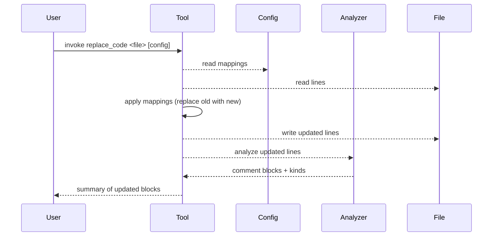

# Find and Replace Block

This tool finds legacy comment blocks in C++ source and replaces them with a new style using a configurable mapping file.

## How It Works
- Reads mappings from `markings.cfg` (or a custom config path). Each mapping defines an `old` block and the `new` block to replace it with.
- Scans the target file line-by-line, matching any configured `old` block (whitespace-insensitive) and emitting the corresponding `new` block while preserving indentation.
- Optionally strips nested markers derived from the config (keeps only the outermost pairs) and warns if unmatched start/end markers remain.
- Writes the updated file in place and reports timing and any warnings.

Diagram


## Build

```bash
mkdir -p build && cd build
cmake ..
cmake --build .
```

### Build scripts
- `scripts/build-release.sh` (bash) and `scripts/build-release.ps1` (PowerShell) wipe `build/`, configure Release with tests off, and build in parallel. Run from repo root: `./scripts/build-release.sh` or `pwsh ./scripts/build-release.ps1`.

## Run

```bash
# Use default config (markings.cfg)
./build/frblock ./examples/example.cpp

# Use a custom config
./build/frblock ./examples/example.cpp -c ./markings.cfg
```

## Config Format (markings.cfg)
- Blocks are defined with markers:
  - `BEGIN` starts an old block
  - `NEW` starts the replacement block
  - `END` ends the mapping
- Lines are matched after trimming leading/trailing whitespace; indentation is re-applied from the source file.

Example:
```ini
# Legacy single-line warning -> block comment
BEGIN
// Code
NEW
/*
*  Code 
*/ 
END

# ASCII art begin -> simple marker
BEGIN
/*******************************************/
/**           BEGIN SECTION               **/
/*******************************************/
NEW
// Section Start
END
```

## What It Detects
- Nested markers can be stripped when `--strip-nested` is passed; unmatched start/end tokens are reported as warnings.

## Notes
- Updates are applied in place; create your own backup if needed.
- Matching is tolerant of surrounding whitespace but otherwise exact per line. Update `markings.cfg` to support additional patterns.
- Set `--strip-nested` to collapse nested start/end markers based on your config; the tool will flag unmatched markers.

## Utilities
- `scripts/parallel.sh`: macOS/Linux helper to run a command per file in parallel. Example: `./scripts/parallel.sh .cpp "./build/frblock"`.
- `scripts/parallel.ps1`: PowerShell version with optional `-Throttle`. Example: `pwsh ./scripts/parallel.ps1 .cpp 'cmd /c find /v /c ""'`.
